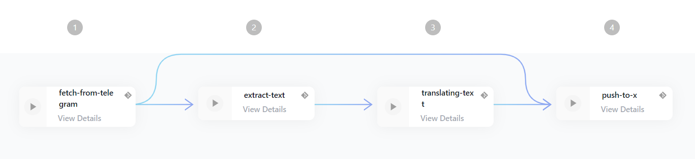

# AI Translation bot

This workflow is translating "memes" from a telegram channel and tweeting them to X. The image-to-text extraction is made by [pytesseract](https://pypi.org/project/pytesseract/) and the translation with [deepl](https://www.deepl.com/translator).

## Showcase of features

This workflow showcases all important features of the platform:

- Using cache to work on images from several steps
- using environment variables
- using meta values
- using secrets
- using dependencies
- using outputs

## Quickstart

1. Create the necessary secrets
   1. Create a [telegram application](https://core.telegram.org/api/obtaining_api_id) and copy the tokens
      1. TELEGRAM_API_HASH
      2. TELEGRAM_API_ID
      3. TELEGRAM_API_SESSION
   2. Create a [twitter app](https://developer.twitter.com/en/apps) and copy the consumer key and secret
      1. TWITTER_CONSUMER_KEY
      2. TWITTER_CONSUMER_SECRET
      3. TWITTER_ACCESS_TOKEN
      4. TWITTER_ACCESS_TOKEN_SECRET
      5. TWITTER_BEARER_TOKEN
   3. Create a [deepl account](https://www.deepl.com/pro.html#developer) and copy the auth key
      1. DEEPL_API_KEY
1. Go to deployments and [create a new deployment](https://edurata.com/deployments)
   1. Enter any name, e.g. `ai-translation-example`
   2. Enter as source repoUrl: `github.com/Edurata/edurata-workflows` and path `examples/ai-translation` and ref `main`
   3. Save and deploy

## Workflow

- [definition](https://github.com/Edurata/edurata-workflows/blob/main/examples/ai-translator.eduwc.yaml)

## Functions

- [fetch-telegram](https://github.com/Edurata/edurata-functions/blob/main/etl/extract/fetch-telegram): This function is fetching the latest messages from a telegram channel. It is using the [telethon](https://pypi.org/project/Telethon/) library.
- [extract-tesseract](https://github.com/Edurata/edurata-functions/blob/main/etl/extract/transform/extract-tesseract.edufc.yml): This function is extracting text from an image. It is using the [pytesseract](https://pypi.org/project/pytesseract/) library.
- [translate-deepl](https://github.com/Edurata/edurata-functions/blob/main/etl/extract/translate-deepl): This function is translating text. It is using the [deepl](https://pypi.org/project/deepl/) library.
- [tweet](https://github.com/Edurata/edurata-functions/blob/main/etl/load/tweet): This function is tweeting a message. It is using the [tweepy](https://pypi.org/project/tweepy/) library.
