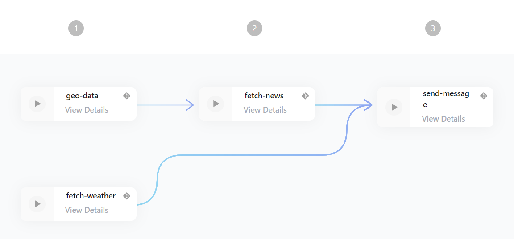

# Breakfast Info

This workflow is taking a location through coordinates (latitude, longitude) and providing daily news and weather information for it. It is just meant as a showcase so the end result is not very useful. All information is provided by [open weather map](https://openweathermap.org/api), [google maps](https://developers.google.com/maps/documentation) and [news api](https://newsapi.org/).

## Quickstart

1. Create the necessary secrets in the [secrets section](https://edurata.com/global/secrets)
   1. Create an account on [open weather map](https://openweathermap.org/api) and copy the token into `WEATHER_API_KEY`
   2. Create an account on [google maps](https://developers.google.com/maps/documentation) and copy the token into `GOOGLE_API_KEY`
   3. Create an account on [news api](https://newsapi.org/) and copy the token into the secret `NEWS_API_KEY`
   4. Create aws credentials that are scoped to ses and copy them into the secrets `AWS_ACCESS_KEY_ID` and `AWS_SECRET_ACCESS_KEY`
1. Go to deployments and [create a new deployment](https://edurata.com/deployments)
   1. Enter any name, e.g. `breakfast-info-example`
   2. Enter as source repoUrl: `github.com/Edurata/edurata-workflows` and path `examples/breakfast-info.eduwc.yml` and ref `main`
   3. Save and deploy

## Showcase of features

- Using a generic function `axios` to call several APIs
- Using secrets

## Workflow

- [definition](https://github.com/Edurata/edurata-workflows/blob/main/examples/breakfast-info.eduwc.yaml)

## Functions

- [axios](https://github.com/Edurata/edurata-functions/blob/main/general/axios): This function is calling an API and returning the result. It is using the [axios](https://www.npmjs.com/package/axios) library.
- [send-ses](https://github.com/Edurata/edurata-functions/blob/main/etl/load/send-ses): This function is sending an email through AWS SES. It is using the [botocore](https://pypi.org/project/botocore/) library.
