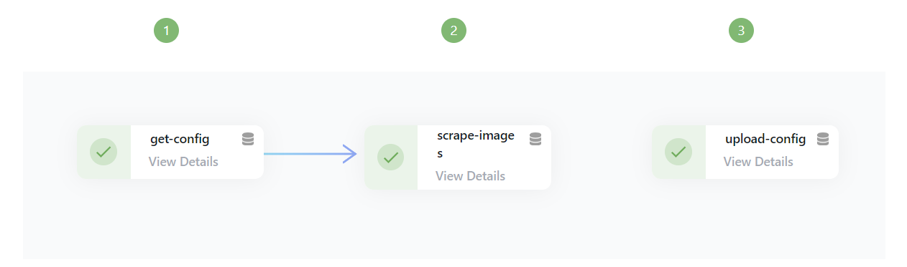

# Scrape images

This workflow is iterating through a list of names of celebrities and googling a picture of them. It is just meant as a showcase so the end result is not very useful. It uses [GoogleImagesSearch](https://pypi.org/project/Google-Images-Search/).

## Quickstart

1. Create the necessary secrets and variables in the [secrets section](https://edurata.com/global/secrets)
   1. Save the google project CX into the variable `GOOGLE_PROJECT_CX`
   2. Create an account on [google maps](https://developers.google.com/maps/documentation) and copy the token into `GOOGLE_API_KEY`
   3. Create aws credentials that are scoped to ses and copy them into the secrets `AWS_ACCESS_KEY_ID` and `AWS_SECRET_ACCESS_KEY`
1. Go to deployments and [create a new deployment](https://edurata.com/deployments)
   1. Enter any name, e.g. `scrape-images-example`
   2. Enter as source repoUrl: `github.com/Edurata/edurata-workflows` and path `examples/scrape-images.yaml` and ref `main`
   3. Save and deploy

## Showcase of features

- Using artefacts to store the result of the scraping
- Using secrets

## Workflow

- [definition](https://github.com/Edurata/edurata-workflows/blob/main/examples/scrape-images.yaml)

## Functions

- [scrape-images](https://github.com/juliandm/penetratethecabinet/blob/main/functions/scrape-images): This custom function is reading a json file with the names of celebrities and another json file with a list of already processed celebrities, iterates through them, gets a picture from google and uploads it to a bucket.
- [download-s3](https://github.com/Edurata/edurata-functions/blob/main/etl/extract/download-s3): This function is downloading both json files from a bucket.
- [upload-s3](https://github.com/Edurata/edurata-functions/blob/main/etl/load/upload-s3): This function uploads the json with the new state to the bucket.
